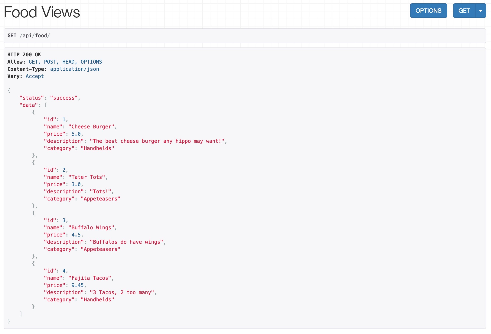
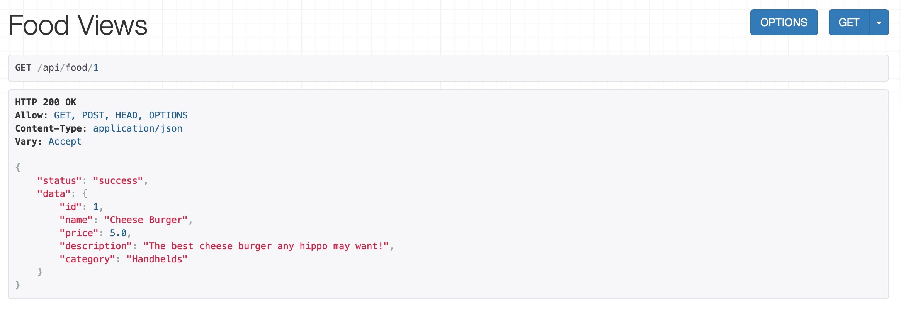
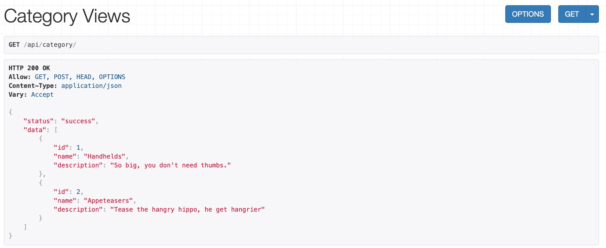
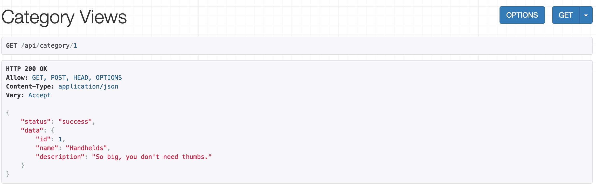
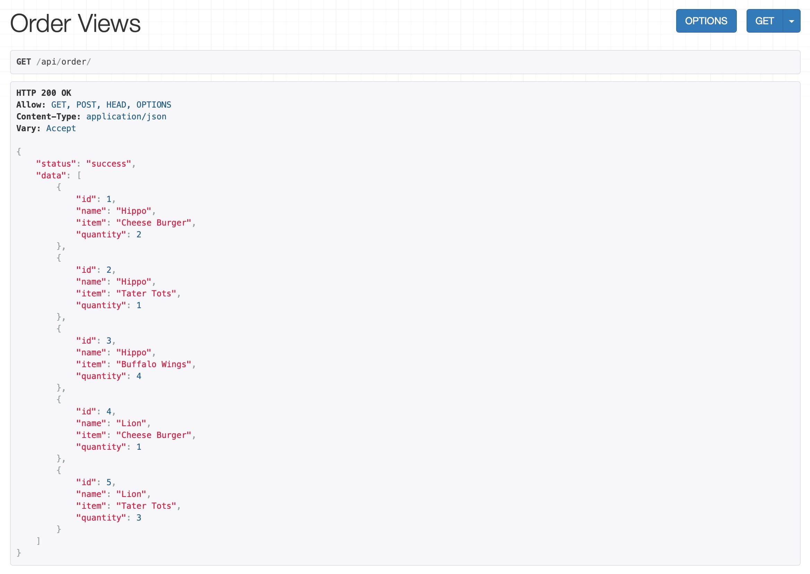
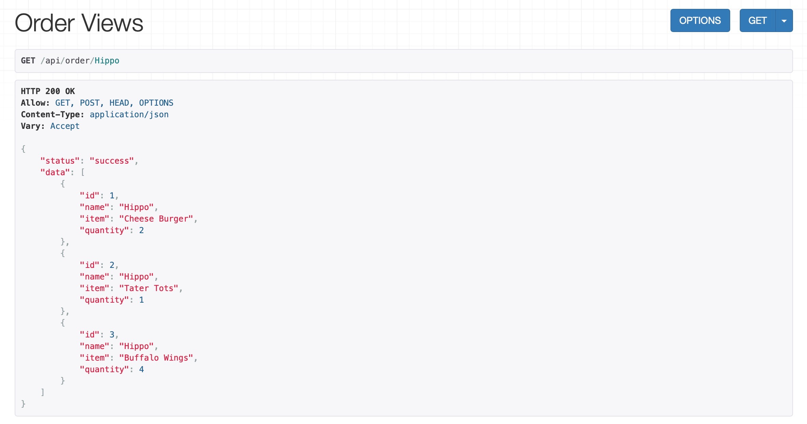
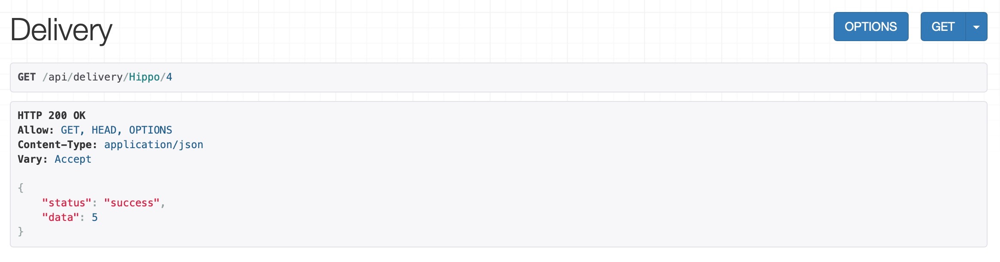
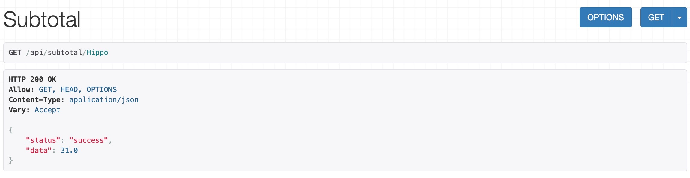
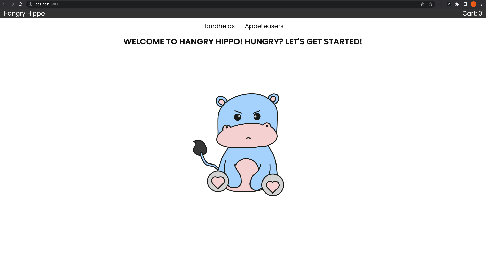

# quantic-test-course

This repository supports the Software Testing course for the MS Software Design and Engineering program at Quantic School of Business & Technology.

## Table of Contents

- What is [Hangry Hippo](#hangry-hippo)?
- [Requirements](#requirements)
  - [Back End](#back-end-requirements)
  - [Front End](#front-end-requirements)
- [Local Installation](#local-installation)
- [Running the Back End](#running-the-back-end)
- [Running Back End Unit Tests](#running-back-end-unit-tests)
- [Running the Front End](#running-the-front-end)
- [Running Front End Functional Tests](#running-front-end-functional-tests)
- [Running User Acceptance Tests](#running-user-acceptance-tests)
- [More Information about Testing](#more-information-about-testing-in-this-repo)

## Hangry Hippo

Hangry Hippo is a (fictitious) new fast-food company. They’re currently developing an online ordering system to debut during their grand opening, which means they need to implement sound testing protocols to make sure the system works perfectly from the start.

## Requirements

The Hangry Hippo app is divided into a back end and a front end. It is preferred, but not required, that you have a [GitHub account](https://github.com/signup) and the [Git command line interface](https://git-scm.com/downloads) (cli) installed.

#### Back End Requirements

The app's back end was originally created using [django](https://www.djangoproject.com/) and the [django REST framework](https://www.django-rest-framework.org/). For more information, read [here](https://stackabuse.com/creating-a-rest-api-with-django-rest-framework/).

The back end requires [Python 3.8](https://www.python.org/downloads/). To make sure this is what your machine is working with, we recommend using this [Python version manager](https://realpython.com/intro-to-pyenv/).

#### Front End Requirements

The front end was originally created using [Create React App](https://create-react-app.dev/), and it requires [Node 18](https://nodejs.org/en/download/current/). To make sure this is what your machine is working with, we recommend using this [Node version manager](https://github.com/nvm-sh/nvm).

## Local Installation

1.  Clone the repo.

        git clone git@github.com:quasifu/quantic-test-course.git

## Running the Back End

1.  Navigate to the `backend` directory.

    Windows:

        cd quantic-test-courses\backend\hangry_api

    macOS/Linux:

        cd quantic-test-course/backend/hangry_api

2.  Set up a virtual environment.

        python3 -m venv env

    > **Note:** `python3 -m venv env` sets up a separate environment where pip can install packages without affecting your global Python installation (if `python3` fails, try `python`).

3.  Activate the environment.

    Windows:

        env\Scripts\activate

    macOS/Linux:

        . env/bin/activate

    > **Note:** The `activate` script activates that environment, after which your command prompt will change to reflect that you're in the `env` environment. You only need to create the environment once; then, for subsequent sessions, just activate the environment with the `activate` script. To exit the environment, use the `deactivate` command. You can learn more about the `venv` module [here](https://docs.python.org/3/library/venv.html).

4.  Install the dependencies.

        pip install -r requirements.txt

5.  Run the server

          manage.py runserver

    > **Note:** If the current working directory isn't included in your OS's PATH environment variable, you'll need to prepend it to the command like so:

    Windows:

        .\manage.py runserver

    macOS/Linux:

        ./manage.py runserver

6.  Verify the server is running by accessing the following API's.

    - http://127.0.0.1:8000/api/food/

      

    - http://127.0.0.1:8000/api/food/1

      

    - http://127.0.0.1:8000/api/category/

      

    - http://127.0.0.1:8000/api/category/1

      

    - http://127.0.0.1:8000/api/order/

      

    - http://127.0.0.1:8000/api/order/Hippo

      

    - http://127.0.0.1:8000/api/delivery/Hippo/4

      

    - http://127.0.0.1:8000/api/subtotal/Hippo

      

## Running Back End Unit Tests

1.  Install the test dependencies.

        pip install pytest django_mock_queries six coverage

2.  Run the tests.

        coverage run -m --source=./hangry_api pytest

    > **Note:** The server should not be running when you run tests.

3.  As a result, you should see something like

        ================= test session starts ===================
        platform linux -- Python 3.8.13, pytest-7.1.2, pluggy-1.0.0
        rootdir: ./quantic-test-course/backend/hangry_api
        collected 5 items

        tests/test_DeliveryCost.py ...                     [ 50%]
        tests/test_SubtotalCost.py ..                      [ 83%]
        tests/test_Tax.py ...........                      [100%]
        ================= 5 passed in 0.16s =====================

4.  [Optional] Generate a coverage report:

        coverage report

    Example Report:

        Name                                                     Stmts   Miss  Cover
        ----------------------------------------------------------------------------
        hangry_api/api/__init__.py                                   0      0   100%
        hangry_api/api/admin.py                                      5      5     0%
        hangry_api/api/apps.py                                       4      4     0%
        hangry_api/api/controllers.py                               23      2    91%
        hangry_api/api/migrations/0001_initial.py                    5      5     0%
        hangry_api/api/migrations/0002_food_category_alter_food_p... 5      5     0%
        hangry_api/api/migrations/__init__.py                        0      0   100%
        hangry_api/api/models.py                                    17     17     0%
        hangry_api/api/serializers.py                               23     23     0%
        hangry_api/api/tests.py                                      1      1     0%
        hangry_api/api/urls.py                                       3      3     0%
        hangry_api/api/views.py                                     84     84     0%
        hangry_api/hangry_api/__init__.py                            0      0   100%
        hangry_api/hangry_api/asgi.py                                4      4     0%
        hangry_api/hangry_api/settings.py                           19     19     0%
        hangry_api/hangry_api/urls.py                                3      3     0%
        hangry_api/hangry_api/wsgi.py                                4      4     0%
        hangry_api/manage.py                                        12     12     0%
        hangry_api/tests/__init__.py                                 0      0   100%
        hangry_api/tests/test_DeliveryCost.py                       22      0   100%
        hangry_api/tests/test_SubtotalCost.py                       15      0   100%
        hangry_api/tests/test_Tax.py                                 7      0   100%
        ----------------------------------------------------------------------------
        TOTAL                                                      254    191    25%

## Running the Front End

1.  Navigate to the `frontend` directory.

        cd frontend

2.  Install the dependencies.

        npm install

3.  Run the server.

        npm run start

4.  A new browser window will open Hangry Hippo at http://localhost:3000

    

5.  [Optional] To use the local back-end APIs, make sure both servers (front-end and back-end) are running. Then, update ./frontend/src/utils/constants.js by replacing this line:

        export const API_URL = 'http://hangry-api-dev.us-east-1.elasticbeanstalk.com';

    with this line:

        export const API_URL = 'http://localhost:8000';

## Running Front End Functional Tests

1.  Run the tests from the `frontend` directory.

        npm test

2.  As a result, you should see something like

         PASS  src/pages/Home/Home.test.js
         PASS  src/App.test.js
         Test Suites: 2 passed, 2 total
         Tests:       3 passed, 3 total
         Snapshots:   0 total
         Time:        2.715 s, estimated 3 s
         Ran all test suites.

## Running User Acceptance Tests

1.  Run Cypress from the `frontend` directory.

        node_modules/.bin/cypress run

2.  Verify that the tests were run. You should see something like

        ==============================================
        (Run Starting)
        ┌─────────────────────────────────────────────┐
        │ Cypress:        10.3.0                      │
        │ Browser:        Electron 100 (headless)     │
        │ Node Version:   v18.5.0                     │
        │ Specs:          1 found (spec.cy.js)        │
        │ Searched:       cypress/e2e/**/*.cy.{js,jsx}│
        └─────────────────────────────────────────────┘
        ───────────────────────────────────────────────

        Running:  spec.cy.js                   (1 of 1)

        Hits Home Page
        ✓ passes (772ms)
        ✓ displays the Welcome message (76ms)

        Hits Order Page
        ✓ passes (426ms)
        ✓ shows Your Order title (109ms)

        4 passing (4s)

        (Results)

        ┌────────────────────────────────────────────┐
        │ Tests:        4                            │
        │ Passing:      4                            │
        │ Failing:      0                            │
        │ Pending:      0                            │
        │ Skipped:      0                            │
        │ Screenshots:  0                            │
        │ Video:        true                         │
        │ Duration:     3 seconds                    │
        │ Spec Ran:     spec.cy.js                   │
        └────────────────────────────────────────────┘

        (Video)

          -  Started processing:  Compressing to 32 CRF
          -  Finished processing: /quantic-test-course/frontend/cypress/videos/spec.cy.js.mp4     (2 seconds)

        ===============================================

        (Run Finished)

        Spec             Tests  Passing  Failing  Pending  Skipped
        ┌─────────────────────────────────────────────────────────┐
        │ ✔spec.cy.js(00:03) 4      4        -        -         - │
        └─────────────────────────────────────────────────────────┘
          ✔All specs passed! 4      4        -        -        -

3.  [Optional] To watch the automated acceptance test run, open the video located at

        /frontend/cypress/videos/spec.cy.js.mp4

4.  [Optional] To run the tests using the Cypress application, open cypress.

        node_modules/.bin/cypress open

## More Information about Testing in this Repo

### Unit Testing

Unit testing is implemented in the `backend` directory using [pytest](https://docs.pytest.org/en/7.1.x/getting-started.html).

### Functional Testing

Functional testing is implemented in the `frontend` directory for the `Home` page using [jest](https://jestjs.io/).

### Acceptance Testing

Acceptance tests are implemented in the `frontend` directory for the `Home` and `Order` pages using [cypress](https://www.cypress.io/).

### Security Testing

Security testing is implemented in the `frontend` directory using [ZAP](https://owasp.org/www-project-zap/). For more information on security testing, visit [OWASP](https://owasp.org/).

### Automated Testing

All of the tests are automated into the CI/CD pipeline using [GitHub Actions](https://github.com/features/actions). GitHub Actions are defined in this repository in the `.github/workflows` folder. Feel free to view the automated runs under the [Actions](https://github.com/quasifu/quantic-test-course/actions) tab of this repository.

&copy; 2022 Quantic School of Business and Technology
